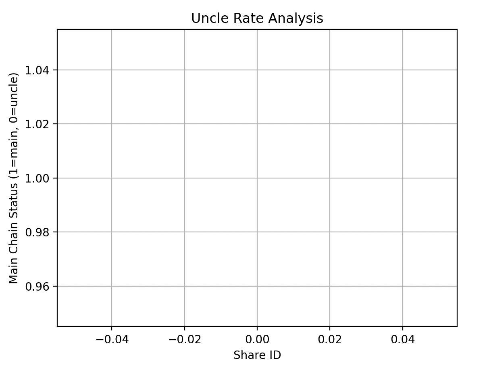

# Uncle Rate Analysis Simulation

This project simulates a simplified peer-to-peer DAG sharechain with focus on uncle block formation.  
It studies how network latency and share production rates influence the number of uncles and orphans.

In decentralized blockchain sharechains, uncle blocks play a critical role in maintaining chain growth despite network delays.  
Before applying to Summer of Bitcoin 2025, I created this project to deeply explore how share propagation latency impacts uncle rate in a DAG-based network.

The project provided hands-on experience with:

- C++ network simulation techniques
- Peer-to-peer share propagation
- DAG graph modeling
- Uncle and orphan detection algorithms
- Data visualization for network behavior analysis

Understanding uncle dynamics is essential for optimizing protocols like P2Pool v2, which depends on share-based decentralized pools.

## Simulation Result

Below is the output graph showing main chain vs uncle shares:

---
Author: Chaitanya Kumar
